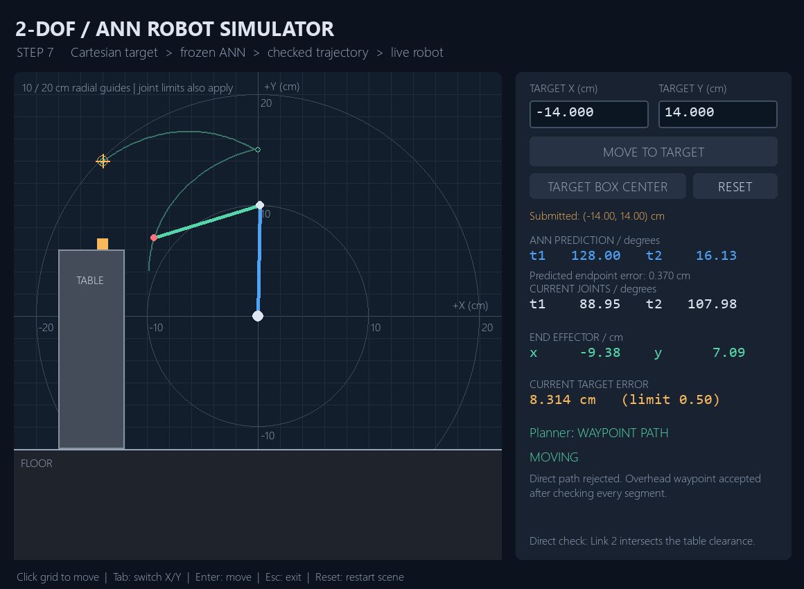

# 2-DOF AI Mathematical Robot

**2D project checkpoint closed — 12 September 2026.** Steps 1–7 are complete, with a physical 2-DOF build guide and starter control code delivered. Hardware has not been built or validated. Full 2D pick-and-place is deferred; a separate `AI-3D-robotic-arm` project may follow later and has not been started.

## Project overview

This project develops a two-link planar robotic arm from mathematical modeling and simulation toward an intelligent physical robot. The goal is a complete manipulation pipeline that can determine a valid robot configuration, reach a target, plan a movement, grasp an object, and place it at a target location.

The initial 2D robot provides a controlled learning environment for principles that can later extend to higher-DOF, 3D robotic arms. Development is incremental:

**Mathematical modeling → Simulation → Configuration-space exploration → Workspace analysis → Inverse-kinematics policy → ML dataset → ANN → Motion planning → Pick and place → Hardware**

## Robot specification

| Parameter | Value |
|---|---|
| Link lengths | L1 = 10 cm, L2 = 10 cm |
| Dataset theta1 limits | −90° to 180° |
| Dataset theta2 limits | −120° to 120° |
| Sampling resolution | 1° per joint |
| Base | (0, 0); +X right, +Y up |
| Angle convention | theta1 counter-clockwise from +X; theta2 relative to Link 1 |

The notebook's validated `RobotArm2DOF.forward_kinematics()` is the source of truth for dataset generation and reconstruction checks. The earlier interactive sliders currently allow ±180° and the class does not enforce joint limits; the limits above describe the datasets.

## Progress and roadmap

| Step | Status |
|---|---|
| 1 — Mathematical model | ✅ Complete |
| 2 — Interactive simulation | ✅ Complete |
| 3.1 — Configuration-space generation | ✅ Complete |
| 3.2 — Workspace analysis | ✅ Complete |
| 3.3 — IK ambiguity resolution + ML dataset | ✅ Complete |
| 4 — TensorFlow ANN training | ✅ Complete |
| 5 — ANN inverse-kinematics validation | ✅ Complete |
| 6 — Simulated box pickup | ✅ Complete |
| 7 — Interactive ANN simulator + table + trajectory planning | ✅ Complete |
| 8 — Gripper / complete 2D pick-and-place | Deferred outside the closed 2D scope |
| Physical 2-DOF hardware | Guide + starter code complete; physical build not started |

## Physical 2-DOF hardware guide

Read [hardware_2d_robot_plan.md](hardware_2d_robot_plan.md) for the BOM, motor/controller comparisons, three build diagrams, assembly, wiring, calibration and first-test procedure. The recommended arm uses **two DS3218 270° positional servos, Uno R3, an external 5 V / 6 A supply, two lightweight 100 mm links, a plywood base and a pointer**. The existing laptop runs the saved ANN and sends checked angles over USB; the Uno generates calibrated, smooth servo commands. A 16×2 I2C LCD is optional. No gripper or box is needed.

The starter firmware ships **disarmed and calibration-locked**. Review the guide before building, and complete the [calibration checklist](hardware/calibration_checklist.md) before enabling motion. [Validation notes](hardware/validation_notes.md) record 33 passing Python tests, offline frozen-ANN inference and Uno compilation; these do not establish physical accuracy or safe mechanical travel. The trained ANN, datasets, validated FK and existing simulation remain unchanged.

## Project structure and datasets

```text
forward_kinematics.ipynb       # Robot model, simulation, data generation, Steps 3.2–3.3
ann_inverse_kinematics.ipynb   # Step 4: baseline ANN preparation, training, and diagnostics
ann_ik_validation.ipynb      # Step 5: held-out test evaluation and manual target helpers
simulated_box_pickup.ipynb   # Step 6: approach, attachment, lift, and honest failure demos
robot_pipeline.py           # Load frozen ANN and existing notebook definitions
pickup_simulation.py        # Pickup states and motion frames, separate from drawing
interactive_robot_sim.py    # Step 7: Pygame input, dashboard, rendering and live motion
trajectory_planner.py       # Step 7: workspace checks, collision checks and waypoint planning
requirements-ann.txt         # Tested ANN environment (Python 3.11)
requirements-sim.txt        # Existing ANN dependencies + Pygame 2.6.1
requirements-hardware.txt   # Existing ANN dependencies + pySerial 3.5
hardware_2d_robot_plan.md   # Practical build guide; hardware is not yet built
hardware/                  # Python serial bridge, wiring, calibration, figures and checks
arduino/                   # Calibration-locked controller and loose-servo neutral test
data/
  robot_configurations.csv    # Complete raw configuration-space dataset
  robot_ik_training.csv       # Deterministic IK samples for future ANN training
models/
  ik_ann.keras               # Trained baseline with best validation weights
  input_scaler.joblib        # Train-fitted position scaler
  output_scaler.joblib       # Train-fitted angle scaler
  split_indices.npz          # Fixed train/validation/test row indices
  training_history.csv       # Per-epoch scaled MSE and MAE
  training_metadata.json     # Dataset hash, versions, settings, and results
evaluation/
  test_predictions.csv       # Every test target, prediction, error, and joint-limit flag
  summary.json               # Test metrics, branch-proximity analysis, and source hashes
simulation/
  box_pickup.gif             # Successful reference pickup-and-lift animation
  first_attempt.gif          # First scene: attached, then lift rejected
  pickup_results.json        # All three scene outcomes and baseline hashes
  interactive_simulator.png  # Step 7 live dashboard preview
  step7_checks.json          # Frozen-model planning examples and Step 6 regression results
  *.png                      # Static snapshots of pickup and failed pickup
tests/
  test_pickup_simulation.py  # State transitions checked with the original robot model
  test_trajectory_planner.py # Geometry, route rejection, waypoint success and speed limits
  check_frozen_planner.py    # Optional real-ANN integration and Step 6 regression check
```

- **Raw dataset:** 65,311 rows, columns `theta1, theta2, x, y`. Preserve this ground-truth dataset for analysis and future configuration policies.
- **IK training dataset:** 39,555 rows, columns `x, y, theta1, theta2`. Future ANN inputs are `[x, y]` (cm); outputs are `[theta1, theta2]` (degrees). No analysis helper columns are included.

The raw data contains **25,756 Cartesian groups with two valid configurations**. Direct regression on both labels could average incompatible joint configurations. Step 3.3 groups coordinates rounded to six decimals in cm, checks grouping stability and valid paired configurations, and retains original coordinate values in the final CSV.

Our **first IK policy** prefers positive theta2 (elbow-down for a target on +X), keeps negative theta2 when it is the only valid branch, and retains straight configurations. Positive-only selection would lose 6,764 reachable targets under the joint limits. The fallback preserves all sampled targets: 32,520 positive, 271 straight, and 6,764 negative configurations.

All selected targets are unique at the grouping precision and reconstruct within 1e-9 cm using the existing forward-kinematics method. X and Y each span −20 to +20 cm; radial reach spans 10 to 20 cm. The workspace is not a filled disk or complete annulus.

This policy can introduce discontinuities where selection switches branches. Unique labels do not guarantee easy ANN regression; Step 5 identifies large misses near the branch transition. A future state-aware policy may use the current robot configuration to minimize movement and support safe trajectories; it is not implemented yet.

## Step 4 baseline results

The ANN uses only `robot_ik_training.csv`: inputs `[x, y]` (cm), outputs `[theta1, theta2]` (degrees). Seed 42 produces **31,644 training / 3,955 validation / 3,956 reserved test** rows. Separate StandardScalers for inputs and targets are fitted on training rows only. The current IK policy is unchanged.

The network is **2 → Dense(64, ReLU) → Dense(64, ReLU) → Dense(2, linear)** with **4,482 trainable parameters**. It uses Adam (0.001), scaled MSE loss, scaled MAE monitoring, and batch size 128. Early stopping with patience 20 ended training at **207 epochs** and restored **epoch 187**, with best validation MSE **0.00440394**. Restored-model validation MAEs are **1.7447° for theta1** and **2.1763° for theta2** (overall **1.9605°**).

Training and validation errors decrease substantially, then validation improvements level off with some fluctuations. There is no sustained validation-error rise indicating clear overfitting. Random-split validation describes interpolation within this sampled workspace. Step 4 used validation data only; the reserved test results follow below.

## Step 5 test results

The frozen baseline was evaluated on all **3,956 reserved test targets**, after verifying the dataset hash and saved split. No model, scaler, dataset, or policy was changed. The original `RobotArm2DOF` class is loaded directly from the mathematical notebook, with no duplicate FK implementation.

| Metric | Result |
|---|---:|
| theta1 / theta2 test MAE | 1.9545° / 2.4038° |
| Mean / median Cartesian error | 0.4942 / 0.3460 cm |
| 95th percentile Cartesian error | 0.9881 cm |
| Within 0.5 / 1 cm | 70.30% / 95.17% |
| Maximum Cartesian error | 32.7641 cm |

Most predictions are close, but large misses cluster near the lower-left branch transition. Mean error is **2.077 cm** for 176 test targets within 1 cm of an opposite-branch sample, versus **0.420 cm** for 3,746 farther targets; 34 straight targets are excluded only from this proximity analysis. This is a sampled association, not an exact boundary-distance measure or proof of cause. The worst target **(-8.264, -9.848) cm** misses by **32.764 cm**, even though its predicted angles satisfy the limits.

There are **56 joint-limit violations**. The geometric rates above retain all predictions; requiring both joint-limit validity and error ≤1 cm gives **94.54%**. Step 5 did not clip, retrain, or redesign the policy. `models/training_metadata.json` remains the historical Step 4 record; Step 5 metrics live in `evaluation/summary.json`.

## Step 6 simulated pickup

The frozen ANN now drives a simple point-gripper simulation: approach the box center, attach only within **0.5 cm**, and request a **2 cm lift**. Predicted angles are checked against joint limits before motion. Attachment preserves the existing hand-to-box offset, and lift success depends on the actual final box position. Rejected lifts hold the last accepted attached pose; missed pickups leave the box untouched.

| Scene | Result |
|---|---|
| First target (12, 8) cm | Attached at 0.483 cm error; lift rejected because its predicted box error was 0.622 cm |
| Reference target (10, 10) cm | Pickup and lift succeeded: 0.148 cm approach error, 1.863 cm actual rise, 0.167 cm final box error |
| Known worst Step 5 target | 32.764 cm approach miss; box never attached or moved |

The first scene was chosen before prediction. The reference scene was added after the rejected lift, with all settings unchanged; all outcomes are retained. These are demonstrations, not an unbiased success-rate measurement. The simulation uses joint interpolation and ideal attachment without box rotation, forces, collision checking, a table, or finger mechanics. It stops with the box attached; planning and complete pick-and-place remain later stages. The ANN, datasets, IK policy, and previous notebooks/reports are unchanged.

## Running the notebook

Open the notebook with its working directory set to the repository root. It uses NumPy, Pandas, Matplotlib, IPython/Jupyter, and `ipympl` for interactive sliders.

To rerun analysis without regenerating raw data, execute the NumPy, `RobotArm2DOF`, and `robot` definition cells, then Step 3.2 or Step 3.3. Step 3.3 reads the raw CSV and writes only `data/robot_ik_training.csv`. Earlier generation cells intentionally regenerate the raw CSV when run. Saved notebook outputs show the analysis without requiring the interactive backend.

For ANN work, use a dedicated Python 3.11 environment, install `requirements-ann.txt`, select that environment's Jupyter kernel, and open `ann_inverse_kinematics.ipynb`. Section 4.8 shows how to load the model and scalers for predictions without retraining. Reuse `split_indices.npz` in Step 5 only after verifying the dataset SHA256 recorded in `training_metadata.json`; indices are zero-based data-row positions after the CSV header. Numerical history and software versions are saved with the model.

Open `ann_ik_validation.ipynb` to reproduce the evaluation without retraining. It includes error distributions, workspace comparisons, worst cases, branch-proximity analysis, and `predict_angles(x, y)` / `evaluate_target(x, y)` helpers for targets in cm. The notebook reads all existing inputs and writes only the `evaluation/` reports.

Open `simulated_box_pickup.ipynb` for Step 6; its setup reuses the original robot class and Step 5 prediction helper without running their notebooks. Change the scene constants to try a target and inspect its actual result. Saved GIFs and PNGs in `simulation/` can be viewed without TensorFlow. Run state-transition checks from the repository root with `python -m unittest discover -s tests -v`.

## Step 7 — Interactive ANN simulator and trajectory planning

Enter a Cartesian **X/Y target in centimeters** and press **MOVE TO TARGET**. The standalone Pygame application loads the existing input scaler, frozen ANN and output scaler through `robot_pipeline.py`. The original `RobotArm2DOF` still supplies every robot coordinate. The ANN, scalers, IK policy, datasets and Steps 1–6 are unchanged.

**Inverse kinematics:** where should the joints end up? **Trajectory planning:** how should the robot move there safely from its current configuration? The ANN supplies target joint angles; the planner decides whether and how to move to those angles. There is no analytical IK fallback, angle clipping or retraining.



### Run and controls

Use a Python 3.11 environment. From the repository root:

```sh
python -m pip install -r requirements-sim.txt
python interactive_robot_sim.py
```

For a new environment on Windows PowerShell, these commands avoid depending on activation scripts:

```powershell
python -m venv .venv
.\.venv\Scripts\python.exe -m pip install -r requirements-sim.txt
.\.venv\Scripts\python.exe interactive_robot_sim.py
```

The earlier working ANN environment can also install `requirements-sim.txt` and run the application directly. No notebook execution or training is needed. Resource paths resolve relative to the application file. Loading and planning run on one worker; the Pygame window continues processing events while they finish.

- Click an X/Y field to replace its value. **Tab** switches fields; **Ctrl+A** selects the whole value; **Backspace/Delete** removes text; **Enter** submits.
- **MOVE TO TARGET** submits the typed coordinates. Clicking the grid submits that location through the same validation, ANN and planning pipeline.
- **TARGET BOX CENTER** submits the configured box center; clicking the box does the same.
- **RESET** explicitly resets the simulation to `(90°, 0°)` and cancels pending motion. It is a scene reset, not a planned homing move. Stale worker results cannot move the reset robot.
- **Esc** or the window close button exits. Target submission is disabled during loading, planning and motion; reset remains available.

The dashboard distinguishes the submitted target, ANN joint prediction, **predicted endpoint error**, current joint state, actual hand position, **current target error**, planner mode and status. A rejected ANN prediction leaves the robot in its last accepted pose. The green preview follows the actual FK hand trajectory; small green rings show requested waypoints. Orange marks the target/tolerance and the static box.

### Scene and validation

Edit `Scene` and `PlannerSettings` in `trajectory_planner.py` to change the scene and thresholds:

| Setting | Default |
|---|---|
| Solid rectangular table/obstacle | X = −18 to −12 cm; Y = −12 to 6 cm (6 cm wide, 18 cm high) |
| Floor | Y = −12 cm |
| Static box | Center (−14, 6.5) cm; side length 1 cm |
| Target and waypoint ANN error limit | 0.5 cm |
| Link/table/floor clearance | 0.15 cm |
| Per-joint maximum speed | 45°/s |
| Fixed simulation update | 120 Hz; rendering capped around 60 FPS |

The first input screen rejects non-finite/non-numeric values, radii outside 10–20 cm, and targets farther than 0.27 cm from the raw dataset's sampled workspace. That neighborhood covers the maximum half-grid-cell displacement of the 1° samples, approximately 0.262 cm. This is an **approximate workspace screen near joint-limit boundaries**, not an exact continuous reachability proof. It uses only raw `(x,y)` positions, never dataset angles as replacement IK. The displayed 10/20 cm circles are radial guides, not the complete joint-limited workspace boundary.

Targets in the table/floor clearance are rejected. For every ANN target or waypoint, the planner checks finite predicted angles, the original joint limits, FK reconstruction error and collision of the full robot pose. Each rejected candidate reports its reason. The simple box remains a selectable visual target; grasping, attachment, transport and release are reserved for Step 8.

### Direct and waypoint planning

1. **DIRECT PATH:** check the joint-space segment from the current angles to the ANN's goal angles. Accept it only if its whole motion clears the table/floor and passes the nearby-endpoint continuity check.
2. If direct motion is rejected, try Cartesian up/over/approach routes at **Y = 14 cm**, then **Y = 17 cm**, with requested waypoints at most **2 cm** apart. Predict every waypoint using the same saved ANN.
3. If those routes fail, try the single **overhead waypoint (0, 15) cm**, followed by the original target. This coarser route allows curved joint-interpolated hand paths around the central unreachable region. Every joint segment is still collision-checked.
4. Accept only a complete validated route. Otherwise report **NO SAFE PATH** and leave the robot still. The finite waypoint policy is intentionally incomplete: rejection does not prove that every possible route is impossible.

For neighboring requests/achieved endpoints within **3 cm**, a change above **60° in either joint** is rejected as a potential ANN branch jump. The wider overhead legs also have a **120° per-joint candidate-change limit**. Far direct goals can require substantial deliberate rotation; speed-limited continuous motion and collision checks still apply. These thresholds are conservative heuristics, not a cure for the learned IK discontinuity, and can reject valid motions near singular configurations. No angle wrapping silently changes the commanded route.

Collision checking uses a line-segment/axis-aligned-rectangle intersection test for **both links**, including endpoint and edge contact. The floor check uses the lowest joint/endpoint height, which also bounds the straight links. For motion, joint intervals initially span at most 0.5°. At each midpoint, obstacles are expanded by the clearance plus a conservative bound on link displacement over half the interval: `(L1 + L2)*abs(delta_theta1) + L2*abs(delta_theta2)`, with these half-interval angles in radians. Ambiguous intervals are subdivided up to seven times, then rejected if still uncertified. This guards against obstacles between samples; it may reject very tight routes. It models geometric links and clearance, not rigid-body contact physics or self-collision.

Accepted joint segments use cubic easing, with zero velocity at each waypoint. Duration is at least `1.5 * largest_joint_change / 45`, so the peak joint speed stays at or below 45°/s. A fixed timestep advances the robot while the [Pygame clock](https://www.pygame.org/docs/ref/time.html) controls rendering and the [event loop](https://www.pygame.org/docs/ref/event.html) keeps controls responsive. A long OS pause slows the simulation clock rather than skipping ahead; runtime pose checks stop at the last safe state if a collision is detected.

### Review examples and checks

Try these with the default scene:

| Action | Recorded result |
|---|---|
| Reset, move to (10, 10) | Direct path; final error 0.148 cm |
| Reset, move to (−10, 4), then (−14, 14) | Second direct path is table-blocked; overhead waypoint route succeeds with 0.370 cm final error |
| Reset, select box center | Direct path; 0.087 cm error; box stays on the table |
| Move to (10, −10) | ANN endpoint error 5.749 cm; rejected before motion |
| Move to (21, 0) / (−15, 0) | Unreachable / target inside table |

The detour's first two routes remain recorded as failures: ANN waypoint errors were **0.601 cm** and **0.557 cm**, respectively. The overhead candidate succeeds without changing the 0.5 cm threshold. The table location and overhead point were selected during engineering checks to provide a useful demonstration. These examples are not an unbiased ANN accuracy measurement.

```sh
python -m unittest discover -s tests -v
python tests/check_frozen_planner.py
```

**21 unit tests passed**: the seven existing Step 6 tests plus 14 planner tests. Coverage includes direct acceptance, both-link and floor collisions, segment edge cases, an obstacle between clear sampled poses, waypoint success with dense trajectory checks, unreachable/bad input, invalid ANN results, excessive error, branch jumps, rejected goals, no partial failed routes, and continuous speed-limited motion. Tests reuse the original robot class; canned predictions isolate planning from TensorFlow.

The optional integration command uses the **real frozen ANN** for seven planning cases and reproduces all three original Step 6 outcomes. It checks 2,001 poses per accepted example, verifies input hashes and writes `simulation/step7_checks.json`. A development smoke run also exercised typed/mouse/box controls, invalid inputs, resets during planning/motion, and matching motion states at 30/60/120 Hz render cadences using SDL's headless video driver. Saved Pygame frames were visually inspected; perceived smoothness on your display still needs your review.

**The 2D project is closed at Step 7 plus the hardware-guide milestone. Review the hardware plan before any physical build; further software development and the separate 3D arm remain future work.**
