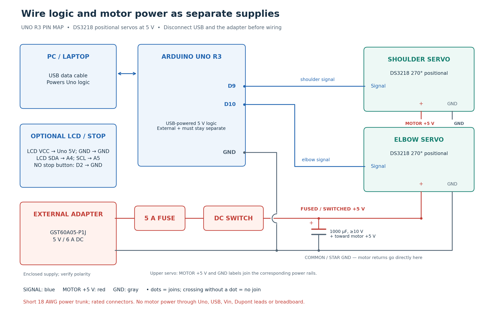

# Wiring and serial reference

Companion to the [hardware plan](../hardware_2d_robot_plan.md). The default is **Uno R3 + two DS3218 270° positional servos + an external regulated 5 V / 6 A supply**. Do this wiring with the adapter disconnected from mains and USB disconnected.



## Required connections

| From | To | Notes |
|---|---|---|
| PC USB data cable | Uno USB-B | Powers controller logic; serial at 115200 baud |
| Uno D9 | Shoulder servo signal | Commonly orange/yellow/white; check the actual lead label |
| Uno D10 | Elbow servo signal | Same requirement; do not use D0/D1 for these motors |
| Adapter DC positive | Inline 5 A fuse → DC-rated power switch → positive distribution terminal | Default supply is **5 V**; measure polarity first |
| Positive distribution terminal | Both servo positive leads, usually red | Motors connect in parallel; each has its own branch |
| Both servo ground leads, usually brown/black | Negative distribution terminal | Short return branches; do not route motor current through Uno or breadboard |
| Adapter DC negative | Negative distribution terminal | Common/star return |
| Uno GND | Negative distribution terminal | Required signal reference |
| Capacitor positive / negative | Positive / negative distribution, after switch | 1000 µF, at least 10 V; polarity matters |

**Leave the external positive rail disconnected from Uno 5V, Vin and barrel input.** USB powers the Uno; only the grounds are joined. Never connect two positive supplies merely because both are marked 5 V. A shared ground does not mean the servo supply should flow through the Uno.

Use a short 18 AWG power trunk, securely terminated branches and rated connector hardware. Verify the adapter's actual barrel size and polarity against its datasheet; a physically similar plug may be loose or reversed. Mount the switch where it can be reached without entering the sweep area. The fuse rating must also be appropriate for the smallest protected wire/connector; do not increase it to disguise stalls. Insulate terminals and provide strain relief. Do not put high servo current through solderless breadboard contacts or thin jumper leads.

The external adapter's **6 A is available current capacity**; it does not force 6 A into the servos. The voltage must match the motors. The GST60A **07** is 7.5 V and is not the recommended **05** model. Check the delivered label, not only the listing title. Sources: [power-supply datasheet](https://www.meanwell.com/Upload/PDF/GST60A/GST60A-SPEC.PDF), [Arduino servo/common-ground guidance](https://support.arduino.cc/hc/en-us/articles/360017053760-Troubleshoot-servo-motors).

## Optional 16×2 I2C LCD

| LCD/backpack pin | Uno R3 pin |
|---|---|
| VCC, verified 5 V module | Uno 5V (small display logic/backlight only) |
| GND | Uno GND |
| SDA | A4 / SDA |
| SCL | A5 / SCL |

Install **hd44780 by Bill Perry**, set `ENABLE_LCD` to `1`, and re-upload the controller. It uses `hd44780_I2Cexp` to locate/configure common PCF8574 or MCP23008 backpacks. Do not assume a universal 0x27 address. Adjust the backpack contrast trimmer if the backlight works but characters do not. Try Library Manager's `hd44780 → ioClass → hd44780_I2Cexp → I2CexpDiag` example if needed. The optional display shows DISARMED/MOVING/HOLD and **commanded** angles; it does not measure the joints. [Upstream library](https://github.com/duinoWitchery/hd44780).

A 0.96-inch OLED is an alternative, not something the supplied sketch requires or drives. On the exact [Adafruit 5 V-compatible I2C board](https://learn.adafruit.com/monochrome-oled-breakouts/wiring-128x64-oleds), VIN/GND/SDA/SCL connect to 5V/GND/A4/A5. Generic OLEDs can have different supply and logic limits; verify their documentation or add level conversion. Do not apply 5 V to an unspecified 3.3 V-only display. Do not install LCD and OLED libraries together without checking SRAM use.

## Optional buttons and servo-driver board

A **normally-open stop button** connects Uno **D2 to GND**. The sketch uses `INPUT_PULLUP`; pressing it reads LOW and detaches both outputs. It does not automatically restart when released. This is a software convenience, not a certified emergency stop: the independent DC servo-power switch remains necessary. No keypad/joystick is needed for PC coordinate input. Spare pins can support future jogging controls after the basic build is verified.

A PCA9685 is unnecessary for two servos; the Servo library already supplies the pulses. If adding one later, its **VCC is logic power**, while **V+ is external motor power**; keep grounds common and respect the board/connector current ratings. Its 16 channels do not imply it can power 16 high-torque motors. It requires a different output-driver implementation and calibration, so the present firmware does not support it. [PCA9685 wiring reference](https://learn.adafruit.com/16-channel-pwm-servo-driver/hooking-it-up).

## Serial protocol

ASCII, **115200 baud, 8 data bits, no parity, 1 stop bit**, one LF-terminated command per line. CR before LF is tolerated. The receive line is limited to 63 characters; oversized, non-printable or timed-out partial lines are discarded. All angles are **robot angles in degrees**, not servo-library 0–180 positions or pulse widths.

| Command | Reply / behavior |
|---|---|
| Boot / USB reset | `READY 1`; outputs detached |
| `INFO` | `INFO 1 calibrated q1min q1max q2min q2max home1 home2 speed` |
| `ARM` | `ARMED` only after verified calibration and released stop button; applies HOME pulses |
| `PING` | Refreshes 1.5 s link watchdog; no reply |
| `MOVE id theta1 theta2` | `OK id`, then later `DONE id commanded_theta1 commanded_theta2` |
| `STOP` | `STOPPED`; disables motion and detaches servo pulses |
| Invalid command / state / limits, stop button, lost heartbeat | `ERR reason`; disarms |

Example **after calibration and manual alignment**:

```text
PC:   INFO
UNO:  INFO 1 1 0.000 120.000 0.000 110.000 90.000 0.000 15.000
PC:   ARM
UNO:  ARMED
PC:   MOVE 1 0.506 90.176
UNO:  OK 1
PC:   PING             (repeat every 0.4 s; Python does this automatically)
...
UNO:  DONE 1 0.506 90.176
PC:   STOP
UNO:  STOPPED
```

`id` is an increasing integer from 1 to 65535 per armed session. No queued moves or automatic resend is permitted. Arduino rejects a second move while busy. Python verifies matching IDs and the reported commanded endpoint; it terminates the session if an acknowledgement is missing, malformed, mismatched or interrupted by reset. The default uncalibrated sketch reports `INFO 1 0 ...` and rejects ARM.

The watchdog remains active while armed, including idle holding. Python's heartbeat thread runs while the user types. If the host dies, the cable disconnects or communication fails, the controller stops advancing setpoints and detaches on timeout. A pulse detach is not a power cutoff or feedback-controlled brake; test your particular motor and use the physical power switch if necessary. After any uncertain motion or stop, realign before arming again.

## Troubleshooting at the bench

| Symptom | Check first |
|---|---|
| Uno resets when motors start | Servo power incorrectly routed through Uno/USB, voltage sag, loose ground or undersized wiring |
| Servo turns the wrong direction | Measured signed calibration slope and mechanical mounting orientation |
| Servo rotates continuously | Wrong motor variant; do not continue as an angle-controlled arm |
| Motor buzzes or heats while stationary | Binding, hard stop, too much load, wrong pulse range; cut power and inspect |
| Python cannot open COM port | Correct port, USB data cable, board driver, and Serial Monitor closed |
| `CALIBRATION_REQUIRED` | Complete the checklist; flag intentionally defaults to false |
| `LIMIT` / host hardware-limit rejection | Requested ANN configuration outside measured physical range; do not clip it |
| `LINK_TIMEOUT` | Host/cable/serial problem; do not resume using the previous assumed position |
| Consistent XY shift | Origin, link-axis distances, horn neutral or pointer offset |
| Direction-dependent error | Backlash, bracket flex or loose horn/fasteners |
