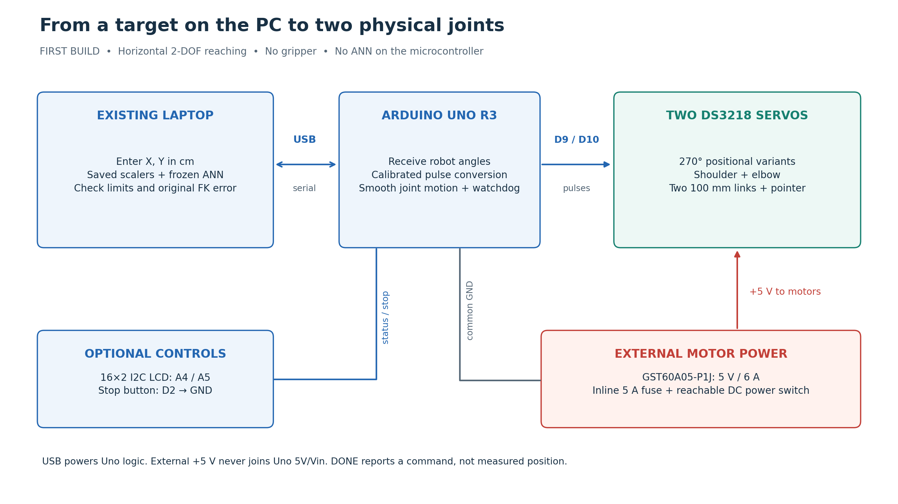
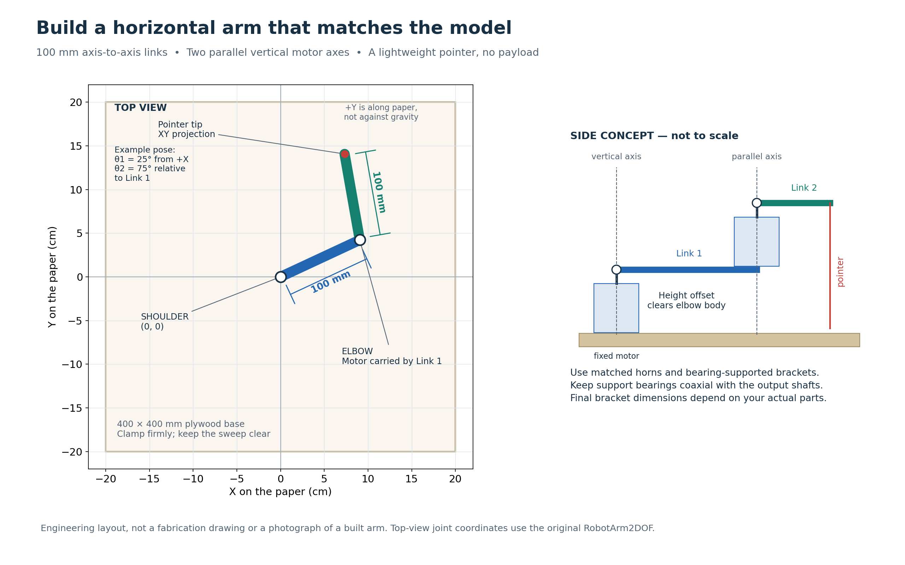

# Physical 2-DOF robot: first-build guide

**Status: hardware plan and starter code delivered; no physical robot has been built or validated here.** This closes the current 2D software project at its agreed checkpoint. A separate `AI-3D-robotic-arm` project may be created later; it has not been started.

Build a small **horizontal tabletop arm with two 100 mm links and a lightweight pointer**. Your existing PC runs the saved ANN; an Arduino Uno R3 receives robot angles and generates servo pulses. There is no gripper, box, payload handling or pick-and-place in this build.

Read this guide first, then use the detailed [wiring notes](hardware/wiring_notes.md) and [calibration checklist](hardware/calibration_checklist.md) at the bench. Component references were checked on **12 September 2026**. Prices below are rough USD planning allowances, not live quotations; local availability, tax, shipping and authenticity affect cost.

## 1. What we are reusing

The repository already contains the mathematical robot, a frozen **2→64→64→2 ANN with 4,482 parameters**, saved input/output scalers, held-out validation, a Pygame simulator and a geometric trajectory planner. `robot_pipeline.py` loads the original `RobotArm2DOF` and prediction helper directly from their notebooks. The hardware bridge reuses it without running training or rebuilding FK.

The model assumes **L1 = L2 = 10 cm**, with theta1 counter-clockwise from +X and theta2 **relative to Link 1**. The full training limits are theta1 −90…180° and theta2 −120…120°. Real servos, brackets and cable routing will usually allow less motion. The starter hardware profile deliberately allows only **theta1 0…120°, theta2 0…110°**, subject to your measured calibration. This is an additional hardware acceptance limit; the dataset and IK policy are unchanged.

**Keep the physical joint-axis distances at 100 mm.** Buying or cutting 150 mm links and merely editing FK constants would leave the frozen ANN trained for the wrong geometry. For this build, correct the mechanics to match the model. A different robot geometry needs its own separately reviewed model/data work.

## 2. Recommended bill of materials

| Item / recommended model or specification | Qty | Role and selection reason | Budget, USD | Lower-cost alternative / caveat |
|---|---:|---|---:|---|
| **DS3218 positional 270° servo**, genuine/specification-confirmed variant | 2 | Shoulder and elbow; metal gearing and useful torque margin; identical motors simplify spares and calibration procedure | $15–30 each | MG996R positional version, roughly $8–18 each; less travel and margin; recalibrate and reduce limits |
| **Arduino Uno R3**, ATmega328P, 5 V logic | 1 | Beginner-friendly USB and Servo-library support; accessible headers | $25–35 | Reputable Uno-compatible board $8–15; USB driver/chip can differ |
| **MEAN WELL GST60A05-P1J**, regulated **5 V / 6 A**, plus suitable grounded AC lead | 1 | Enclosed external supply; no exposed mains terminals; reserve current for two servos | $30–50 including lead allowance | Reputable regulated 5 V / ≥6 A enclosed adapter, correctly rated connector and polarity; do not use an unverified phone charger |
| Plywood base, approximately **400×400×9–12 mm** | 1 | Rigid clampable foundation and coordinate-grid support | $8–15 | Flat scrap plywood, if stiff and securely clamped |
| Lightweight links, **100 mm between axes**, approximately 20–25 mm wide | 2 | 3 mm birch plywood or ribbed PETG parts; low moving mass | $8–20 total | Scrap ply; avoid heavy steel and brittle thin acrylic near screw holes |
| DS3218-compatible servo mounting brackets and matched metal horns/hubs | 2 sets | Mount base motor; carry elbow motor on Link 1; transfer torque without loose spline fit | $10–25 total | Printed brackets plus the supplied matched horns; inspect flex and screw retention |
| Supported pivot hardware / coaxial idler bearings, spacers and shoulder bolts sized to brackets | 2 joint sets | Reduce cantilever load and joint wobble; keep support axes aligned with servo axes | $10–20 total | Matched robot-servo bearing bracket kits; do not press a random bearing over a servo spline |
| M3 screws, washers, nyloc nuts, standoffs | 1 assortment | Secure brackets and links; spacers prevent rubbing | $5–10 | Existing hardware with verified fit and screw depth |
| Colored lightweight pointer, blunt pen body or foam marker | 1 | Shows XY position on paper without a gripper | $1–3 | Paper flag; avoid contact force at the tip during first tests |
| USB data cable matching Uno's USB-B socket | 1 | PC serial link and Uno logic power | $3–6 | Existing data-capable cable |
| 18 AWG stranded main power pair, screw-terminal distribution, servo extension leads | 1 set | Short low-resistance power paths and strain relief | $8–15 | Reuse suitably rated wiring; Dupont leads are for signals, not the servo power trunk |
| Inline **5 A fuse + holder**, accessible **DC-rated ≥10 A power switch**, insulated connector rated ≥6 A | 1 set | Interrupt servo power; protect the power wiring; use the exact adapter connector dimensions/polarity | $8–15 | No substitute that removes the independent power cutoff |
| **1000 µF, ≥10 V electrolytic capacitor** | 1 | Local bulk decoupling near distribution; observe polarity | $1–3 | 470–1000 µF, ≥10 V; cannot compensate for an undersized supply |
| **16×2 HD44780 LCD + PCF8574 I2C backpack**, 5 V | 1 optional | Readable local status with only SDA/SCL; supported by the optional sketch setting | $5–12 | Omit initially and use PC status; Adafruit MCP23008 backpack + LCD is a documented higher-cost alternative |
| Normally-open momentary stop button | 1 optional | D2 software stop, in addition to the independent power switch | $1–3 | PC Ctrl+C is convenient but cannot replace a reachable power switch |
| Multimeter, ruler/protractor, clamps, graph paper | As needed | Power/polarity checks, calibration and endpoint measurements | $15–35 if missing | Borrow tools; do not skip voltage measurement |
| Existing laptop | 1 | ANN inference and target entry | **$0 additional** | See PC guidance below |

Allow roughly **$150–300 for new robot parts**, including the optional display/button but excluding tools and the laptop; reused parts can reduce this. Do not buy an entire new laptop for this ANN. The [Uno store](https://store.arduino.cc/products/arduino-uno-rev3), [power-supply datasheet](https://www.meanwell.com/Upload/PDF/GST60A/GST60A-SPEC.PDF) and [servo bracket example](https://www.pololu.com/product/3435) are reference anchors; the bracket is a fit-check example, not a guaranteed DS3218-compatible kit.

### Motor trade-offs and the chosen default

| Option | Relevant facts | Decision for this arm |
|---|---|---|
| SG90 | Small, plastic-geared; manufacturer lists 1.8 kgf·cm stall torque at 4.8 V | Good for learning one unloaded servo. Not the default for a durable two-link arm with an elbow motor on Link 1 |
| MG996R | Metal-geared; 9.4 kgf·cm at 4.8 V, 11 kgf·cm at 6 V; travel depends on the actual positional variant | Viable budget option with lightweight links and narrower measured motion; not a drop-in full-workspace replacement |
| **DS3218 270° positional** | Datasheet lists 18 kgf·cm stall torque and 1.8 A stall current at 5 V; 4.8–6.8 V supply range; 180° and 270° variants exist | **Recommended**, using two identical verified 270° units at 5 V |
| NEMA 17 stepper + suitable current-limited driver | Frame size is not a torque rating; choose from the exact motor's torque/speed data. Needs a driver per axis, separate supply, homing and often reduction/support bearings | Useful later for a different mechanical design; more setup and moving mass than this first build needs |

Specifications: [SG90 manufacturer](https://towerpro.com.tw/product/sg90-analog/), [MG996R manufacturer](https://towerpro.com.tw/product/mg996R/), [DS3218 manufacturer datasheet](https://www.dsservo.com/d_file/DS3218%20datasheet.pdf), [stepper examples and individual datasheets](https://www.pololu.com/category/87/stepper-motors).

Buy a **position-controlled 270° version**, not a 180° version with the same label and not a “360° continuous rotation” servo. Continuous rotation usually commands speed/direction rather than an absolute joint position. An ordinary 180° servo cannot realize the dataset's 270° shoulder span or 240° elbow span. Even a 270° motor needs margin from its mechanical stops and room for its cables: do not command the entire nominal range just because it appears on the label.

The DS3218 datasheet specifies 500–2500 µs control pulses and 1500 µs neutral for its positional variants. The starter uses `writeMicroseconds()`, because Arduino's `write(0…180)` convention does not directly describe a 270° motor. The example slope is **2000/270 ≈ 7.407 µs/degree**, but each real motor's sign, neutral and useful range must be measured. Those numbers are not a calibration certificate for a seller's particular unit.

### Torque: check the actual moving mass

Published hobby-servo torque is **stall torque**, not a continuous working load. Do not size an arm to operate near stall. Flex, gear backlash, heating, acceleration and an off-axis mounting load all matter; a “20 kg” label does not mean the tip can lift 20 kg.

For a worst-case **vertical-plane, horizontally extended** arm, use masses in kg and lengths in cm to estimate gravitational torque in kgf·cm:

```text
shoulder ≈ m_link1 × L1/2 + m_elbow_servo × L1
         + m_link2 × (L1 + L2/2) + m_tip × (L1 + L2)
elbow    ≈ m_link2 × L2/2 + m_tip × L2

Example masses: Link 1 0.040 kg; elbow motor 0.060 kg;
                Link 2 0.030 kg; pointer 0.005 kg.
L1 = L2 = 10 cm:
shoulder ≈ 1.35 kgf·cm; elbow ≈ 0.20 kgf·cm.
```

These are design assumptions, not measurements of a built arm. Include brackets, horns, wiring and screws in the appropriate masses before sizing; add tip offsets to the lever arm if present. Seek at least **2–3× static-load margin** as a preliminary engineering allowance, then test temperatures, current and stiffness at low speed. This margin alone does not establish a servo's continuous-duty rating.

The shoulder carries more downstream mass and normally needs more torque. Using the same stronger model for both axes simplifies the first build. A horizontal tabletop layout removes ideal gravitational torque **about the vertical rotation axes**, but bearings and brackets must still carry weight and bending loads. It does not remove friction, inertia or backlash. Keep the links light and let proper supports carry the load instead of using a long unsupported servo shaft as the whole joint.

### Controller and input choices

| Option | Trade-off |
|---|---|
| **Uno R3** | Recommended: straightforward USB, 5 V logic, roomy headers, and the supplied AVR/Servo sketch |
| Classic Nano, ATmega328P | Similar role in a smaller package; convenient after bench testing, but smaller connections and USB variants need care |
| ESP32 DevKit | More resources and wireless options; 3.3 V logic and different libraries/pin rules add work not needed here |

References: [Uno R3](https://docs.arduino.cc/hardware/uno-rev3), [classic Nano](https://docs.arduino.cc/hardware/nano), [ESP32 DevKitC](https://docs.espressif.com/projects/esp-dev-kits/en/latest/esp32/esp32-devkitc/user_guide.html). The supplied sketch targets **Uno R3**, not every board with “Uno” or “Nano” in its name.

Use **PC keyboard input for X/Y**. Add the **16×2 I2C LCD for local status** after the two servos work. It is readable and economical in Uno RAM. A 0.96-inch OLED offers nicer graphics but a full 128×64 framebuffer alone uses 1024 bytes of the Uno's 2048-byte SRAM with a typical buffered library. Buttons suit stop/enable; a rotary encoder suits small jogging adjustments; a keypad adds wiring and entry menus; a joystick suits jogging rather than precise coordinates. None is necessary for the first target-entry interface.

## 3. Hardware architecture



1. PC accepts XY, applies the **saved** input scaler, runs the **frozen** ANN and applies the saved output scaler.
2. PC checks numeric input, the existing sampled workspace, robot/hardware angle limits, nearby branch jumps and reconstructed endpoint error. Rejected targets send no MOVE command.
3. USB serial sends the accepted **robot joint angles in degrees**. The Uno converts them to calibrated pulses and advances both joints smoothly together.
4. The external adapter supplies the motors. USB supplies the Uno and optional small LCD. Grounds meet at the power distribution point; the two positive power rails are not joined.

The Uno does not run TensorFlow. TinyML deployment is only a possible future experiment, not part of this first architecture. The PC does not infer that a physical target was reached merely because the commanded pulses finished changing.

## 4. Mechanical layout and assembly



This is a **top view**: +X points right and +Y points up the paper/away from you. Both motor axes are vertical and parallel. “Up” in the XY drawing is not upward against gravity. Link 2 can sit at a different height to clear the elbow motor, provided both axes remain parallel and its pointer projects vertically to the correct XY endpoint.

1. Cut and clamp the plywood base. Mark the shoulder axis as `(0,0)` and add a measured XY grid. Leave the full sweep area clear of tools, cables and hands.
2. Mount the shoulder servo body rigidly at the base with its shaft vertical. Use its mounting ears and suitable bracket, not adhesive alone.
3. Bench-test and calibrate the loose motors as described below **before fitting long links**.
4. Attach Link 1 to the matched shoulder horn/hub. Locate the elbow axis exactly **100 mm from the shoulder axis**. The link blank may need to be longer than 100 mm to accommodate screws and brackets.
5. Fix the elbow motor body to Link 1. Keep its axis parallel to the shoulder. A bearing-supported bracket with a coaxial idler/support is preferable to an unsupported cantilever. Do not force a generic bearing over the output spline or create a second, misaligned rotation axis.
6. Fit Link 2 to the elbow horn; measure **100 mm from elbow axis to the pointer's projected center**. Use standoffs or a small height offset to prevent link/bracket rubbing.
7. Fit a lightweight blunt pointer. It should hover just above the paper at first. Drawing with a pen adds contact load and is a later calibration experiment; no laser is needed.
8. Secure wiring along Link 1 with a flexible loop at each joint. Sweep the unpowered geometry gently without forcing gears; verify cables do not wrap or become tight.
9. Install the separate power distribution and accessible cutoff switch, following the pin-level wiring notes. Keep electronics outside the swept area.
10. Upload the neutral-test sketch, calibrate each axis, then upload the two-servo sketch. Add the LCD only after serial and servo tests pass.
11. Test a narrow central angle range at low speed. Increase the permitted range only after checking actual bracket, wire and base clearances.

The Step 7 virtual table is **not a model of this plywood assembly**. The physical starter assumes an empty, manually verified sweep area and does not import the simulator's virtual obstacles. Its slow joint interpolation is not certified physical collision avoidance. Stop if the arm rubs, binds, oscillates or the supply voltage sags.

## 5. Wiring and power


The chosen [GST60A05-P1J adapter](https://www.meanwell.com/Upload/PDF/GST60A/GST60A-SPEC.PDF) is **5 V / 6 A**, not 6 V and not the 7.5 V model from the same series. Two DS3218 datasheet stall currents at 5 V total about **3.6 A**; a 6 A supply offers current headroom. This does not permit sustained stalling. Check the actual voltage **at the servo distribution point while moving**, because thin leads and poor connectors can cause a large drop.

Connect servo signals to **D9 and D10**, servo positives to the fused/switched external positive rail, and servo grounds to the external return. Connect Uno **GND** to that return. **Do not power these servos from Uno 5V, USB, Vin or a breadboard rail.** Do not connect external +5 V to the Uno +5 V while USB is powering the Uno. The shared ground is a signal reference; motor current should return directly through the external power wiring. Arduino's [servo power guidance](https://support.arduino.cc/hc/en-us/articles/360017053760-Troubleshoot-servo-motors) illustrates the common-ground requirement.

Use an enclosed adapter and ready-made AC lead suitable for your mains outlet; do not open the adapter or build exposed mains wiring. Install the fuse near the low-voltage output. Match the connector to the datasheet and confirm polarity with a meter. A fuse protects wiring, not fingers or a servo's gears. A logic stop or `detach()` removes pulses but is **not physical power isolation**; keep the independent motor-power switch reachable. Some servo variants can behave differently after pulses disappear, so verify this during bench testing.

Full connections, optional display/button details and PCA9685 trade-offs are in [hardware/wiring_notes.md](hardware/wiring_notes.md).

## 6. Calibration before enabling motion

**Robot zero and servo neutral are different concepts.** Robot `(0°,0°)` means both links point along +X. A servo's nominal 1500 µs neutral is simply a motor control reference. The example mounting places shoulder neutral at robot theta1 = 45° and elbow neutral at relative theta2 = 0°. Actual mounting and direction may differ.

For each motor, the controller uses:

```text
pulse_us = neutral_us + signed_us_per_degree × (robot_angle_deg − neutral_robot_angle_deg)
```

Increasing theta1 must turn Link 1 counter-clockwise in the top view. Increasing theta2 turns Link 2 counter-clockwise **relative to Link 1**, not relative to the world axes. If the direction is reversed, change that motor's signed slope after measurement. Correct neutral/spline alignment with measured offsets; do not change the ANN to compensate for bad mounting.

Use the [calibration checklist](hardware/calibration_checklist.md) to measure dimensions, neutral, sign, scale and safe limits. `CALIBRATION_VERIFIED` intentionally ships as **false**: uploading or opening USB will not arm an uncalibrated arm. Set it true only after documenting your measurements and testing the actual range. Each new session also requires manual alignment to the configured **HOME = (90°,0°)** before ARM. Without shaft encoders, the controller cannot safely discover an unknown initial position by pretending it is already at home.

## 7. PC-to-Arduino starter code

| File | Purpose |
|---|---|
| [hardware/python_serial_control.py](hardware/python_serial_control.py) | Offline ANN checks and interactive USB control; reads physical limits from the controller |
| [arduino/servo_controller/servo_controller.ino](arduino/servo_controller/servo_controller.ino) | Bounded command parser, per-axis calibration, limits, synchronized easing, heartbeat timeout and optional LCD |
| [arduino/servo_neutral_test/servo_neutral_test.ino](arduino/servo_neutral_test/servo_neutral_test.ino) | One loose servo: neutral and small manual pulse adjustments |
| [requirements-hardware.txt](requirements-hardware.txt) | Existing ANN dependencies plus pySerial 3.5 |

From the repository root in the working Python 3.11 ANN environment:

```sh
python -m pip install -r requirements-hardware.txt
python hardware/python_serial_control.py --target 10 10
```

This **offline command opens no serial port**. It displays predicted angles, the original FK endpoint and ANN error. Physical limits cannot be confirmed without the calibrated controller. Numeric values are rounded to 0.001° for the serial protocol and checked again before transmission.

In Arduino IDE, install **Arduino AVR Boards**, select **Arduino Uno**, install **Servo** from Library Manager and open the relevant sketch. For the optional LCD, also install **hd44780 by Bill Perry**, then set `ENABLE_LCD` to 1. Run that library's `I2CexpDiag` example if the display is not detected. The [library's upstream documentation](https://github.com/duinoWitchery/hd44780) explains compatible backpacks. The supplied firmware defaults to LCD disabled.

After calibration and wiring, close Arduino Serial Monitor so Python can own the port:

```sh
python -m serial.tools.list_ports
python hardware/python_serial_control.py --port COM3
```

Replace `COM3` with your controller's actual port. The bridge reads the controller profile, explains home alignment and waits for you to type `ARM`. Then enter `x y`, for example `10 10`. The special `angles 90 0` command is for deliberate calibration checks; normal XY control always uses the ANN. `quit`, `stop`, Ctrl+C or EOF ends the session and sends STOP. Use the physical power switch immediately if motion is wrong.

The protocol and replies are documented in [hardware/wiring_notes.md](hardware/wiring_notes.md#serial-protocol). Only one move can be outstanding. Acknowledgements and completion IDs are checked; no automatic retry is made after an uncertain move. Python sends heartbeats every 0.4 s, including while waiting for your input. The firmware detaches on a 1.5 s heartbeat timeout, a stop-button press or a malformed/invalid command. USB reset also disarms. It updates a cubic-eased setpoint every 20 ms at a configured peak rate of **15°/s** per joint; there is no busy movement loop.

`DONE` and LCD angles describe the **commanded** setpoint, not encoder measurements. The firmware keeps sending holding pulses while the session stays armed. On any stop, disconnect, reset or power interruption, recheck physical alignment before a new ARM. See [pySerial documentation](https://pyserial.readthedocs.io/en/latest/pyserial_api.html) and the [Arduino Servo implementation](https://github.com/arduino-libraries/Servo) for the underlying serial and pulse interfaces.

## 8. PC recommendation

**Use your existing laptop.** The development machine inspected for this repository has an **Intel Core i7-9750H and 12 GB RAM**, and it has already run the frozen ANN and simulator checks successfully. A dedicated GPU is unnecessary for this 4,482-parameter network.

For another computer, a practical minimum is a supported 64-bit x86 laptop, 8 GB RAM, SSD storage with roughly 10 GB free for Python/tools, and a working USB data port. A comfortable development setup is a recent Core i5/Ryzen 5 class CPU, **16 GB RAM** and a 256 GB or larger SSD. These are engineering recommendations for the whole development environment, not minimum RAM required by this tiny network. Reuse the pinned Python 3.11/TensorFlow environment; do not upgrade it casually just for hardware control. [TensorFlow installation guidance](https://www.tensorflow.org/install/pip) covers platform support; CPU inference is sufficient here.

## 9. First physical test plan

1. **Power-only check:** outputs disconnected; verify adapter polarity and rail voltage. Connect one loose motor at a time; check for overheating, chatter and resets.
2. **Single-servo check:** use the neutral sketch with its horn/link removed. `N` enables 1500 µs; `+`/`-` changes by 20 µs within an initial 1100–1900 µs window; `X` detaches. Measure direction and angle, then cut power when done. Do not run a blind full-range sweep.
3. **Serial check:** controller boot must say `READY 1`; `INFO` must report calibration and limits. With the default unverified sketch, ARM must be rejected. The guide is not permission to skip calibration.
4. **Known joint poses:** after calibration, align home and use direct calibration commands with the area clear. Start with small changes around `(90,0)`, then check `(0,0) → (20,0) cm`, `(90,0) → (0,20) cm`, `(0,90) → (10,10) cm`, and `(45,90) → (0,14.142) cm` if your measured limits permit them. Values come from the existing FK convention.
5. **ANN targets:** try `(10,10)`, `(0,15)` and nearby accepted points. A software-rejected target is not a hardware failure; do not silently change branches or force its angles through.
6. **Measure actual XY:** put graph paper under the pointer, align its origin and axes to the shoulder, and measure the pointer's vertical projection. Check a printed 100 mm reference with a ruler; do not trust “fit to page.”
7. **Record three errors separately:** ANN error `distance(FK(predicted angles), target)`; physical tracking/calibration error `distance(measured tip, FK(predicted angles))`; total target error `distance(measured tip, target)`. These vector effects need not add as scalar distances.
8. **Repeatability:** approach the same accepted target five times, then approach from the opposite direction. Record the spread and any directional bias from backlash. Start by investigating total errors above about 1 cm or repeated spread above about 0.5 cm; these are provisional debugging thresholds, not a guaranteed performance rating.
9. **Stop tests:** with the horizontal arm unloaded and area clear, test D2 stop, Ctrl+C, USB removal during motion and the independent power switch. Verify the actual servo behavior when signal or power is removed. Re-align before resuming.

Use the blank table in the calibration checklist. If known-angle FK poses are wrong, fix geometry, sign, offset, wiring or backlash first. If FK poses agree but the frozen ANN misses a target, retain that model limitation. The ANN's existing branch-transition errors do not disappear when motors are attached.

## 10. Visual references and verification scope

The diagrams above are original build schematics, not photographs of a completed robot. These captioned references show real components and mounting/wiring details:

- [DS3218 dimensional drawing and control specification](https://www.dsservo.com/d_file/DS3218%20datasheet.pdf): compare case, ear spacing and shaft layout before designing brackets; verify the ordered rotation variant separately.
- [Standard servo bracket photographs and dimensions](https://www.pololu.com/product/3435): illustrates mounting ears, a servo case and attachment to a flat support; compare dimensions rather than assuming universal fit.
- [Arduino external-servo-power wiring photo/diagram](https://support.arduino.cc/hc/en-us/articles/360017053760-Troubleshoot-servo-motors): useful signal/common-ground reference. Our two high-torque motors use screw-terminal power distribution instead of breadboard motor-current paths.
- [16×2 LCD/backpack wiring photographs](https://learn.adafruit.com/i2c-spi-lcd-backpack/arduino-i2c-use): Adafruit uses a different expander than many PCF8574 boards; the supplied `hd44780_I2Cexp` option supports common versions of both.
- [0.96-inch OLED wiring reference](https://learn.adafruit.com/monochrome-oled-breakouts/wiring-128x64-oleds): an optional alternative; follow the exact board's voltage/interface requirements, not just its screen size.
- [PCA9685 hookup photographs](https://learn.adafruit.com/16-channel-pwm-servo-driver/hooking-it-up): future multi-servo wiring reference, unnecessary for two motors.

Software validation is recorded in [hardware/validation_notes.md](hardware/validation_notes.md). Compilation, offline ANN checks and simulated serial replies cannot verify real torque, servo travel, wiring, mechanical clearance, stopping behavior or positioning accuracy. Those require the physical procedures above.

## Recommended first version

Use **two DS3218 270° positional servos**, an **Uno R3**, the **5 V / 6 A GST60A05-P1J external supply**, a clamped plywood base, **two lightweight 100 mm links with supported joints**, and a blunt pointer. Enter XY on the **existing laptop**; add a **16×2 I2C LCD** for local commanded-state status once the basic arm works. Start with the calibrated conservative motion range and a 15°/s rate.

This combination keeps the validated mathematical geometry, avoids unnecessary on-board ML and electronics, gives more mechanical margin than micro servos, and makes errors observable. **Review this plan and complete the calibration checklist before building or enabling the arm.** The 2D project is closed at this documentation/starter-code milestone; physical construction and any separate 3D project remain future work.
